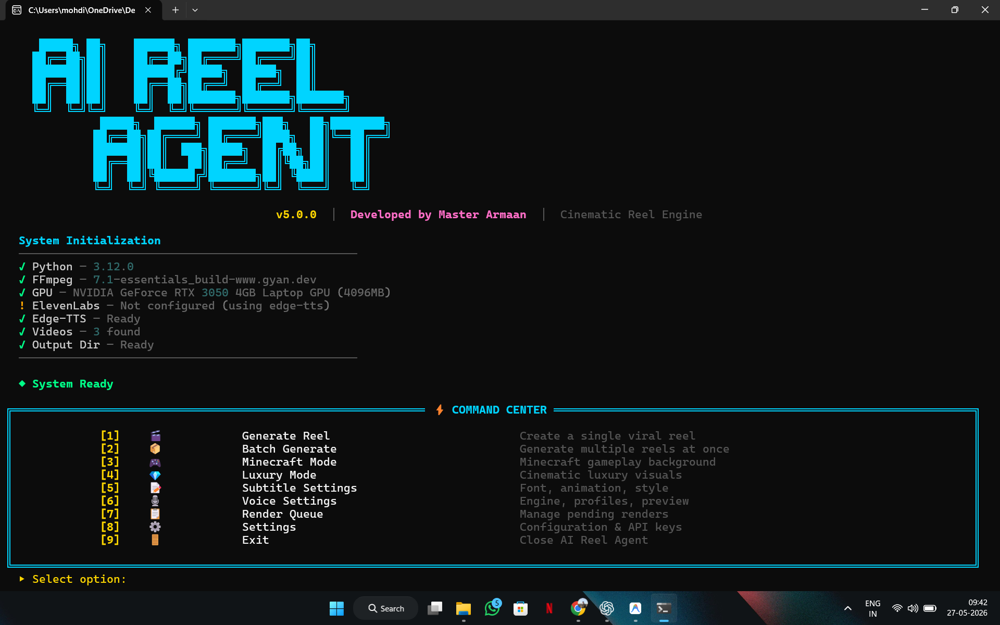
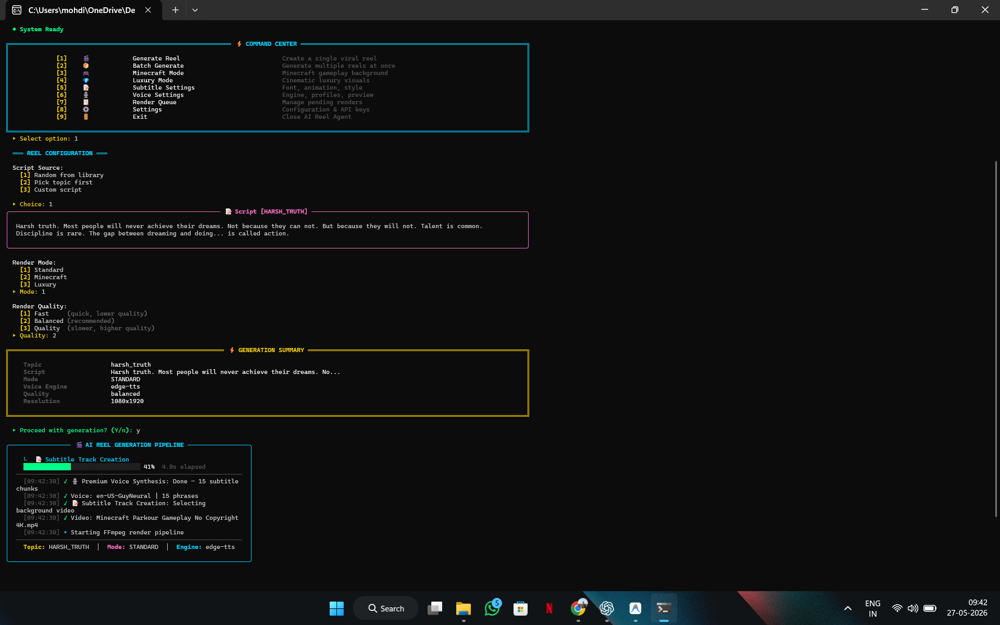
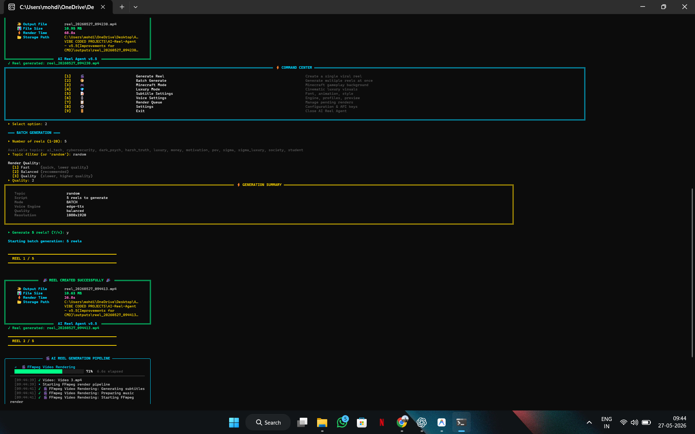
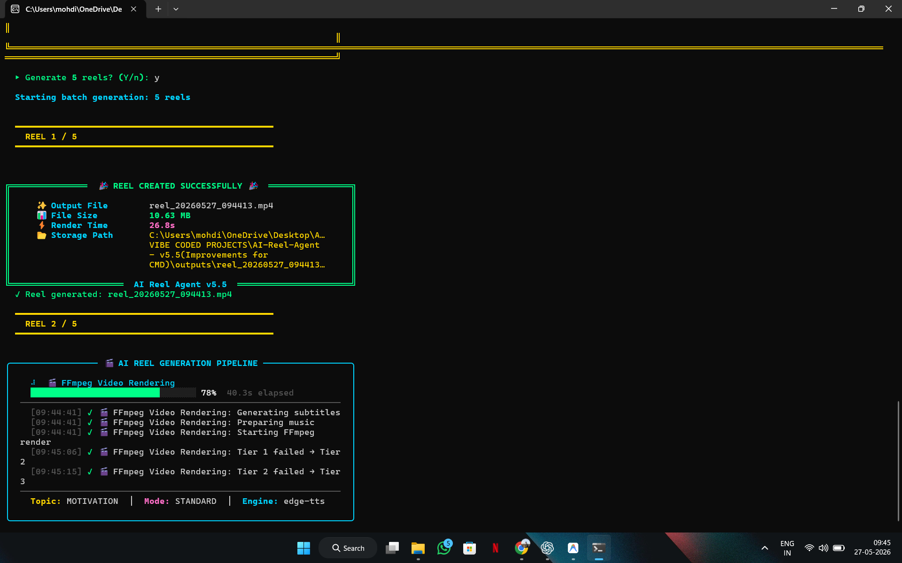

# 🎬 AI Reel Agent

[](https://python.org)
[](https://ffmpeg.org)
[](LICENSE)
[](https://microsoft.com)

> A production-grade, highly optimized cinematic terminal application for procedural AI video generation. Compose, synthesize, master, and render high-impact social reels on local hardware in under 45 seconds.

---

## 📖 Overview

**AI Reel Agent** is a command-line AI-driven multimedia pipeline that automates the entire procedural creation of social media reels. Transitioning away from slow, cloud-dependent video editing interfaces, it executes directly on local systems to orchestrate:
1. **Cartesian script generation** via a modular template phrase engine.
2. **Dynamic case-preserving synonym substitutions** and pacing variation.
3. **High-fidelity voice synthesis** with dual-pass structure and automatic audio mastering (EQ, loudness normalization).
4. **Cinematic subtitle synchronization** using animated Advanced Substation Alpha (`.ass`) formatting.
5. **Hardware-accelerated FFmpeg multi-tier rendering** (zoompan, vignette, color correction, and ambient audio pads mixing).

It provides content creators, marketers, and developers with a single-file distributable executable (`.exe`) that delivers a visual, high-contrast hacker-style terminal user interface.

---

## ✨ Core Features

- 📝 **Modular Phrase Composition**: Bypasses generic LLM generation fees. Composes dynamic scripts using combinatorial Cartesian products across eight structured viral categories (Sigma, Luxury, Cybersecurity, AI Tech, etc.), generating billions of unique combinations in-memory.
- 🎛️ **synonym & Variation Engine**: Preserves word-casing and dynamic grammar rules while injecting natural dramatic pauses, sentence structure shuffling, and call-to-actions (CTAs).
- 🎙️ **Multi-Tier Voice Synthesis**: Topic-aware voice profile mappings executing high-quality ElevenLabs premium voiceover, with seamless automatic fallback to edge-tts dual-pass generation.
- 🎬 **FFmpeg 3-Tier Rendering Pipeline**: Implements mathematical fallback levels (Tier 1 → Tier 2 → Tier 3) ensuring robust video generation under any hardware limitation (hardware-accelerated filters to standard fallbacks).
- 📝 **Kinetic Subtitle Synchronization**: Synchronizes word boundary offsets into stylish animated Substation Alpha captions, supporting luxury gold gradients and high-impact keyword coloring.
- 📊 **Cinematic Live Dashboard**: A unified terminal dashboard built on the `Rich` framework. Prevents line-wrapping and console stdout overlap by using live state refresh and displaying elapsed time counters, active status spinners, and scrolling logs.
- 📦 **PyInstaller Standalone Executable**: Fully bundled, environment-aware single-file EXE compatibility with centralized path resolution helpers supporting immediate execution out-of-the-box.

---

## 📸 Screenshots & UI Showcase

Below are visual showcases of the terminal interface running in active environments:

### 1. Interactive Boot & Menu

*Figure 1: The CLI startup diagnostic displaying system checks, active GPU, and the main interactive configuration menu.*

### 2. Live Rendering Pipeline

*Figure 2: The high-polish dynamic Rich Live console updating pipeline stages, elapsed timers, and active status logs.*

### 3. Batch Render Controller

*Figure 3: Mass video generation console looping through procedural configurations and compilation blocks.*

### 4. Generation Success Card

*Figure 4: Centered double-bordered victory report displaying output file names, file sizes, storage locations, and render times.*

---

---

---

## 🎥 Video Assets

AI-Reel-Agent does not include bundled background footage.

To use the engine properly, simply upload your own long-form videos inside the `videos/` directory.

The system is designed to automatically:
- scan available videos
- pick random segments
- trim cinematic clips
- crop for vertical reels
- sync visuals with generated scripts
- reuse footage dynamically across multiple renders

### Recommended Setup

Instead of uploading many short clips, add:
- 1–2 long videos (recommended 10–100+ minutes)
- high-quality gameplay or cinematic footage
- smooth motion scenes with minimal UI clutter

### Best Results
Recommended video styles:
- Minecraft parkour gameplay
- Luxury lifestyle visuals
- Cinematic B-roll
- Driving footage
- Motivational edits
- AI / futuristic visuals

### Supported Formats
- `.mp4`
- `.mov`
- `.mkv`

### Example

```plaintext
videos/
├── minecraft_parkour.mp4
└── luxury_cars.mp4
```
 
## 🛠️ System Architecture

The project is structured logically into dedicated components separating terminal presentation from the underlying media generation engines:

AI-Reel-Agent/
├── cli/                 # Terminal UI Components
│   ├── animations.py    # Cinematic typewriter and text transition effects
│   ├── app.py           # Main application orchestrator and menu loops
│   ├── logger.py        # Thread-safe session file logging manager
│   ├── menus.py         # Keyboard menu prompts and profile tables
│   ├── panels.py        # Reusable Rich layouts (Success cards, config grids)
│   ├── progress.py      # Live Console Dashboard renderer
│   ├── prompts.py       # Validated Command Line input prompts
│   └── startup.py       # Boot diagnostic and GPU/FFmpeg verification
├── config/              # Centralized Settings & Presets
│   ├── defaults.py      # App default parameters (resolutions, caption scales)
│   ├── manager.py       # Config loader/saver with dot-notation settings.json
│   ├── profiles.py      # Topic mappings, voice pitches, and filter parameters
│   └── scripts.py       # Keyword topic detectors and luxury arrays
├── core/                # Media & Generation Engines
│   ├── utils/
│   │   └── paths.py     # Environment-aware PyInstaller path resolution helper
│   ├── music_engine.py  # Synthesized ambient background pads and caching
│   ├── queue_manager.py # Threaded background job queue manager
│   ├── script_composer.py# Dynamic phrase assembly and template parser
│   ├── script_manager.py# Composed phrases manager with duplicate filters
│   ├── subtitle_engine.py# Animation frame builder and ASS captioneer
│   ├── variation_engine.py# Case-sensitive synonyms and pacing shifter
│   ├── video_renderer.py# FFmpeg 3-tier hardware-accelerated renderer
│   └── voice_engine.py  # Dual-pass TTS master and boundary synchronizer
├── fonts/               # Bundled Open-Source Subtitle Fonts
├── scripts/             # Combinatorial Template JSON Databases
├── main.py              # Primary Application Entrypoint
├── launcher.bat         # Single-click Windows Launcher Script
└── build.spec           # PyInstaller Executable Compilation Specification
```

### Path Compatibility Layer (`core/utils/paths.py`)
To prevent packaging bugs where the single-file EXE cannot locate external directories, our path compatibility helper tracks `sys.frozen` execution states:
- **Internal Assets** (e.g., packaged `fonts/` and default JSON templates inside `scripts/`) are loaded dynamically from `sys._MEIPASS`.
- **Writable Directories** (e.g., persistent `outputs/`, session `logs/`, generated `voices/` audio, and configuration `settings.json`) resolve relative to the physical binary folder (`os.path.dirname(sys.executable)`).

---

## 🚀 Installation & Setup

### Prerequisites
- **Python**: Version `3.10` or higher.
- **FFmpeg**: Handled automatically on setup, or installable via system paths.
- **OS**: Windows (CMD, PowerShell, or Windows Terminal recommended).

### 1. Clone the Repository
```bash
git clone https://github.com/yourusername/AI-Reel-Agent.git
cd AI-Reel-Agent
```

### 2. Standard Python Execution Setup
Install the audited production dependencies:
```bash
pip install -r requirements.txt
```

Run the application:
```bash
python main.py
```

### 3. Windows Single-Click Launch
Double-click `launcher.bat` or run it from the terminal. The launcher automatically verifies Python, compiles dependencies quietly, performs environmental checks, and fires up the CLI.
```bash
launcher.bat
```

---

## 💻 Usage & CLI Arguments

AI Reel Agent operates in both fully interactive menu wizardry and high-speed legacy CLI automation:

### Interactive Mode
Run the main script without arguments to open the high-polished, key-responsive cinematic menu:
```bash
python main.py
```

### Non-Interactive/Batch Mode (Automated Pipelines)
For scripted or headless environments, use legacy flags to trigger immediate, non-interactive generations:

```bash
# Generate 1 reel in the 'sigma' topic
python main.py --count 1 --topic sigma

# Generate 5 reels using the 'luxury' style topic
python main.py --count 5 --topic luxury
```

---

## 📦 Bundling Standalone EXE

To package the entire Python codebase, dynamic JSON phrase databases, and open-source fonts into a single, distributable Windows executable (`.exe`):

1. Install PyInstaller:
   ```bash
   pip install pyinstaller
   ```
2. Build the production package:
   ```bash
   pyinstaller build.spec
   ```
3. The standalone binary will compile and be output to the `dist/` directory as `AI-Reel-Agent.exe`. Move it to the project root directory to execute E2E renders directly!

---

## 🛠️ Technical Stack

- **Runtime**: Python 3.12+ (Fully asynchronous execution via `asyncio`)
- **CLI Framework**: Rich (Live Console, Panels, Tables, Boxes, Status)
- **Audio Synthesis**: Edge-TTS & ElevenLabs API
- **Media Engine**: FFmpeg (via Subprocess with pre-scale filters, hardware zoompan, highpass/lowpass audio filters, vignette filters, and loudness normalization)
- **EXE Packaging**: PyInstaller

---

## 📈 Future Roadmap

- 🖥️ **Desktop GUI Interface**: React/Electron dashboard wrapper for non-CLI creators.
- 🎭 **Advanced Vocal Profile Packs**: Multi-speaker dialogue synthesis and conversational AI scripts.
- ☁️ **Cloud Cluster Rendering**: Offload massive render pipelines to high-powered server farms.
- ⚡ **Direct Social API Integrations**: Automated single-click publishing to Instagram, TikTok, and YouTube Shorts.

---

## 🎓 Credits & Engineering

- **Creator & Lead Architect**: Mohd Armaan Tak
- **Development Workflow**: Architected, directed, and engineered by the creator using advanced AI-assisted development workflows.

This flagship project represents the intersection of programmatic media engineering and human-AI collaborative development, resulting in clean, production-grade, and scalable software.
